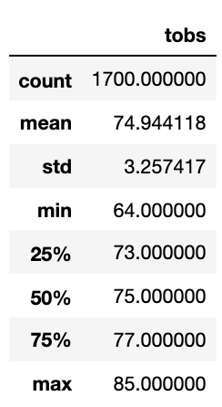
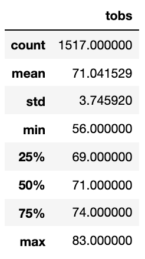

# surfs_up

# Overview

## Purpose
The purpose of this analysis is to compare the weather data between June and December temperature data. 

# Results

The temperature statistical analysis for June is as follows:

The temperature statistical analysis for December is as follows:

Comparing the statistical analysis for both sets of data, we can see that:
- The average temperature in June (74.94) is higher than the average temperature in December (71.0) by 3.94 degrees
- The maximum temperature for both months is roughly the same, 85 degrees for June and 83 degrees for December. The minimum temperature for both months, however, is more different - only 64 degrees for July, but 56 degrees for December
- The standard deviation for June temperatures is lower than December, 3.26 versus 3.75

# Summary

Overall, June temperatures are higher than December, with lower variability

## Additional queries
1. Look at the temperature data year over year, if there are any trends in temperature in recent years
2. Use a histogram to confirm the statistical analysis visually and look for other patterns or findings
